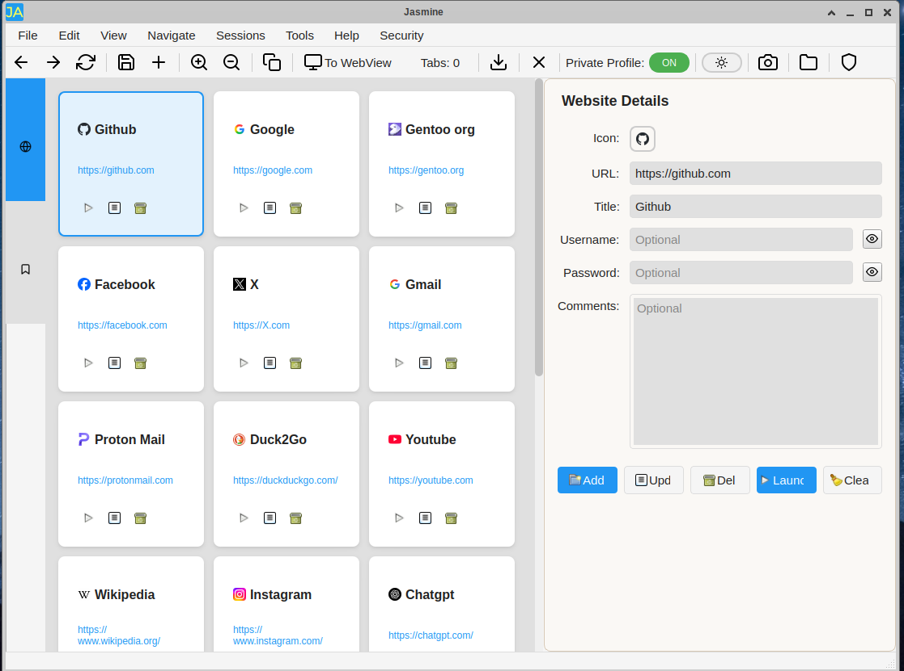

# 🌸 Jasmine



Available in Flathub:
https://flathub.org/en/apps/search?q=alamahant

**Website & Session Manager**

A comprehensive web launcher and session management application that transforms your scattered bookmarks and browser tabs into an organized, launchable workspace.

## 📋 Table of Contents
- [Overview](#overview)
- [Key Features](#key-features)
- [Private Profile System](#private-profile-system)
- [Real-World Use Cases](#real-world-use-cases)
- [Installation](#installation)
- [Quick Start](#quick-start)
- [Advanced Usage](#advanced-usage)
- [Security](#security)
- [Use Cases](#use-cases)
- [Contributing](#contributing)
- [License](#license)

## 🚀 Overview
**Version:** 1.0.0  
**Built with:** Qt Framework  
**Platform:** Cross-platform  

Jasmine combines bookmarking, multi-tab session handling, flexible browsing profiles, and integrated web utilities into one streamlined tool. Perfect for productivity enthusiasts and multi-account managers.

## ✨ Key Features

### 🔥 Core Functionality
- **📚 Smart Bookmarking** - Store websites with titles, URLs, comments, favicons, and login references
- **💾 Session Management** - Create, save, and restore multi-tab browsing sessions with one click
- **🔒 Flexible Web Profiles** - Toggle between isolated private profiles or shared profiles per site
- **👥 Multi-Account Support** - Simultaneously access multiple accounts on the same service without conflicts
- **⚡ Launch Control** - Quick-launch individual websites or entire browsing sessions instantly

### 🛠️ Integrated Utilities
- **📥 Download Manager** - Complete download management system with progress tracking
- **📸 Screenshot Capture** - Take and save screenshots of web pages for documentation
- **🔑 Login Reference** - Store username/password reminders with privacy controls
- **🔐 2FA Integration** - Built-in two-factor authentication code generator
- **📊 Visit Tracking** - Monitor site usage with visit counts and timestamps

### 🔐 Security Features
- **🛡️ Master Password Protection** - Secure your data with encrypted password protection
- **🔒 Private Profile System** - Completely isolated browsing environments
- **🕵️ Incognito Mode** - Temporary private sessions without saving data

## 🎯 Perfect For
- **Managing multiple accounts** on the same service with isolated or shared sessions
- **Users who work with multiple web applications** daily and need integrated utilities
- **Developers managing various development/staging environments** with documentation needs
- **Anyone who wants organized access** to their frequently-used sites with full session control
- **Teams needing quick access** to shared web resources with built-in productivity tools

## 🔒 Jasmine's Private Profile System - Complete Guide

### What Are Private Profiles?
Private profiles are completely isolated browsing environments within Jasmine. Each private profile operates as if it's a separate browser with its own:

- **Cookies and login sessions**
- **Browsing history and cache**
- **Saved passwords and form data**
- **Local storage and website preferences**
- **Download history and settings**

When you use a private profile, that website cannot see or access any data from other tabs, other profiles, or your shared browsing. It's like having multiple browsers running simultaneously, each completely unaware of the others.

### The Two Modes of Private Profiles

#### 1. Incognito Mode (Private Profile Without Saving)
When you launch a website with "Use Private Profile" checked but don't save it as a session:

- ✅ Creates a temporary isolated environment
- ✅ You can browse, log in, and use the site normally
- ✅ All data (cookies, history, logins) exists only while the browser is open
- ⚠️ When you close Jasmine or the tab, ALL data is permanently deleted
- 🔄 Next time you launch that website, it's completely fresh with no memory of previous visits

**Perfect for:** Testing, temporary access, sensitive browsing, or when you don't want to leave any traces

#### 2. Persistent Multi-Account Management (Private Profile With Saving)
When you launch websites with "Use Private Profile" and save them as sessions:

- ✅ Creates permanent isolated environments for each website/account
- ✅ Login states, cookies, and preferences are saved forever
- ✅ Each private profile maintains its own separate data between browser sessions
- ✅ You can have multiple accounts on the same service, each in its own private profile

**Perfect for:** Managing multiple accounts, work/personal separation, or maintaining different identities online

## 🌟 Real-World Use Cases with Examples

### 📧 Gmail Multi-Account Management
**Scenario:** You have personal Gmail, work Gmail, and side-project Gmail accounts.

**Setup:**
1. Launch Gmail with "Use Private Profile" → Log into personal account (john.doe@gmail.com)
2. Launch Gmail again with "Use Private Profile" → Log into work account (john@company.com)
3. Launch Gmail again with "Use Private Profile" → Log into project account (john@startup.com)
4. Save all three tabs as "All Gmail Accounts" session

**Result:** One-click access to all three Gmail accounts simultaneously, each completely isolated. No conflicts, no accidental cross-posting, no logging out of one to access another.

### 💻 GitHub Development Workflow
**Scenario:** You contribute to personal projects, work repositories, and open-source projects.

**Setup:**
1. Launch GitHub with "Use Private Profile" → Log into personal account with your repositories
2. Launch GitHub with "Use Private Profile" → Log into work organization account
3. Launch GitHub with "Use Private Profile" → Log into open-source contributor account
4. Add related development tools (each with private profiles if needed)
5. Save as "Development Session"

**Result:** Switch between different GitHub identities instantly, each with its own commit history, starred repos, and organization access.

### 📱 Social Media Management
**Scenario:** You manage personal accounts plus business/brand accounts.

**Setup:**
1. Launch Twitter with "Use Private Profile" → Personal account
2. Launch Twitter with "Use Private Profile" → Business account
3. Launch Instagram with "Use Private Profile" → Personal account
4. Launch Instagram with "Use Private Profile" → Business account
5. Launch Facebook with "Use Private Profile" → Personal account
6. Launch Facebook with "Use Private Profile" → Business page
7. Save as "Social Media Management" session

**Result:** Manage all accounts simultaneously without constant logging in/out or browser switching.

### 🛒 E-commerce and Shopping
**Scenario:** You want to compare prices, manage different buyer accounts, or separate personal/business purchases.

**Setup:**
1. Launch Amazon with "Use Private Profile" → Personal account with your wishlist and payment methods
2. Launch Amazon with "Use Private Profile" → Business account for company purchases
3. Launch eBay with "Use Private Profile" → Separate account for selling
4. Launch eBay with "Use Private Profile" → Account for buying collectibles
5. Save as "Shopping Accounts" session

**Result:** Access all your e-commerce accounts simultaneously, each with its own purchase history, saved items, and payment methods.

## 🔄 Mix and Match Strategies

### Hybrid Sessions - Combining Private and Shared Profiles
You can create sessions that mix private profiles (for isolation) with shared profiles (for integration):

**Example "Work Session":**
- **Gmail Work** (private profile) → Isolated work email
- **Google Calendar** (shared profile) → Can access work Gmail for calendar integration
- **Slack** (private profile) → Work team communication, isolated from personal
- **GitHub Work** (private profile) → Work repositories only
- **Stack Overflow** (shared profile) → General development research
- **Company Intranet** (shared profile) → General company resources

This gives you isolation where you need it (email, code, team chat) but integration where it's helpful (calendar seeing email, shared research browsing).

### Testing and Development
- **Production site** (shared profile) → Your normal user account
- **Staging site** (private profile) → Test account #1
- **Development site** (private profile) → Test account #2
- **Admin panel** (private profile) → Administrative access
- **Analytics dashboard** (shared profile) → Can see data from production

### Privacy Levels
- **Banking/Financial** (private profile) → Maximum isolation for sensitive accounts
- **Work accounts** (private profile) → Professional identity separation
- **Personal accounts** (private profile or shared) → Depending on privacy needs
- **General browsing** (shared profile) → Convenience for sites that can share data

## 🚀 Advanced Multi-Account Scenarios

### Freelancer/Consultant Setup
- **Client A project tools** (all private profiles) → Completely isolated work environment
- **Client B project tools** (all private profiles) → Separate isolated environment
- **Personal business tools** (private profiles) → Your own business accounts
- **General research/tools** (shared profile) → Non-sensitive shared resources

### Content Creator Workflow
- **YouTube Channel A** (private profile) → Gaming content channel
- **YouTube Channel B** (private profile) → Educational content channel
- **Twitch streaming** (private profile) → Live streaming account
- **Social media for Channel A** (private profiles) → Gaming community accounts
- **Social media for Channel B** (private profiles) → Educational community accounts
- **Research and inspiration** (shared profile) → General content research

## 🔐 Two-Factor Authentication (2FA) Manager

Jasmine includes a built-in Two-Factor Authentication code generator that helps you manage and generate time-based one-time passwords (TOTP) for your accounts.

### What is 2FA?
Two-Factor Authentication adds an extra layer of security to your accounts by requiring a second form of verification beyond just your password. This usually involves a 6-digit code that changes every 30 seconds.

### Key Features
- Generate 6-digit TOTP codes for any 2FA-enabled account
- Real-time code updates every 30 seconds
- Visual countdown timer showing when codes refresh
- One-click code copying to clipboard
- Secure local storage of account secrets
- Support for multiple accounts from different services

### How to Access
- Open the 2FA Manager from the Toolbar icon or the Tools Menu
- The manager opens in a separate window
- Resizable interface with accounts list and code display

### Adding 2FA Accounts
1. Click "Add Account" button
2. Enter account name (e.g., "GitHub", "Google", "Discord")
3. Paste the secret key from the website's 2FA setup
4. Optionally enter the issuer/company name
5. Click OK to save

### Where to Find Secret Keys
When enabling 2FA on websites, they typically show:
- A QR code for mobile apps
- A text secret key (what you need for Jasmine)
- Look for "Can't scan QR code?" or "Manual entry" options

### Using Generated Codes
- Select an account from the list
- Current 6-digit code displays in large text
- Countdown timer shows seconds until next refresh
- Click "Copy Code to Clipboard" for easy pasting
- Codes automatically update every 30 seconds

### Supported Services
Works with any service that supports TOTP 2FA:
- Google/Gmail accounts
- GitHub
- Discord
- Microsoft accounts
- Banking websites
- Social media platforms
- And many more

## 🗂️ Data Management & Privacy

Jasmine provides comprehensive tools to manage your browsing data, sessions, and privacy settings.

### Clean Current Session Data
Clears browsing data from all currently active sessions and the shared profile.

**Data removed:**
- All cookies from active sessions
- HTTP cache from all profiles
- Visited links history
- Temporary browsing data

**When to use:**
- After browsing sensitive websites
- When sharing your computer
- To free up storage space
- For privacy after online shopping/banking

### Clean Shared Profile Data
Clears browsing data only from the shared profile, leaving separate tab profiles untouched.

**Data removed:**
- Shared profile cookies only
- Shared profile cache
- Shared profile visited links

**What's preserved:**
- Individual tab profile data
- Private profile sessions
- Separate profile cookies and cache

### Restore Factory Defaults
⚠️ **Warning: This action cannot be undone!**

Completely resets Jasmine to its original state, removing:
- All saved websites and bookmarks
- All saved sessions
- All application settings and preferences
- Security settings and master passwords
- All browsing data (cookies, cache, history)
- Application data directories
- Profile configurations

### How to Access
All data management options are located in the **Sessions** menu:
1. Click on "Sessions" in the menu bar
2. Scroll to the bottom section
3. Choose your desired cleaning option
4. Confirm the action in the dialog box

### Privacy Recommendations
- **Regular Cleaning (Weekly):** Use "Clean Shared Profile Data"
- **Deep Cleaning (Monthly):** Use "Clean Current Session Data"
- **Emergency Cleaning:** After using public computers or security concerns

## 📥 Download Manager

Jasmine includes a comprehensive download manager that handles all your file downloads with progress tracking, organization, and easy access.

### Key Features
- Real-time download progress tracking
- Download speed and time remaining calculations
- Automatic file organization in dedicated folder
- Duplicate filename handling
- One-click access to files and folders
- Download history management
- Cancel active downloads
- Clean interface with visual progress bars

### How to Access Downloads
**Opening the Download Manager:**
- Click the **Downloads** icon in the toolbar
- Or go to **View → Downloads** in the menu

**Download Location:**
- Files are saved to: `Downloads/Jasmine/`
- Organized in your system's default Downloads folder
- Automatic folder creation if it doesn't exist

### Download Progress Tracking
**Real-time Information:**
- File name and size: Clear identification of what's downloading
- Progress bar: Visual representation of download completion
- Speed indicator: Current download speed (KB/s, MB/s)
- Time remaining: Estimated completion time
- Status updates: Starting, downloading, completed, cancelled

### Download Controls
**During Download:**
- Cancel Button: Stop active downloads immediately
- Open Folder: Access download directory anytime
- Progress Monitoring: Watch real-time progress

**After Download:**
- Open File: Launch downloaded file directly
- Open Folder: Navigate to file location
- Remove from List: Clean up download history

### File Organization
**Automatic Organization:**
- All downloads saved to dedicated Jasmine folder
- Automatic duplicate filename handling
- Files renamed with numbers: `file.pdf`, `file (1).pdf`, `file (2).pdf`
- Preserves original file extensions

### Download Management
**Window Controls:**
- Clear Finished: Remove completed/cancelled downloads from list
- Open Downloads Folder: Quick access to download directory
- Individual Remove: Remove specific items from history

### Usage Tips
- Monitor Progress: Keep download window open to watch progress
- Multiple Downloads: Start several downloads simultaneously
- Quick Access: Use "Open Folder" for easy file management
- Clean History: Regularly clear finished downloads
- Cancel if Needed: Stop unwanted downloads immediately

## 🔒 Security & Privacy Notice

**Optional Security Features:**
- Username/password storage in website entries is **completely optional**
- Master password protection is **optional** but recommended
- 2FA manager is an **optional convenience feature**

**Your Choice, Your Data:**
- Jasmine provides security features as conveniences, not guarantees
- You decide what information to store and what security features to enable
- For maximum security, rely on your browser's built-in password manager
- All data is stored locally on your device

**Disclaimer:**
While every effort has been made to implement reasonable security measures, users are responsible for deciding what information to store and which security features to enable based on their individual risk tolerance.

## 📦 Installation

### Prerequisites
- Qt Framework (LGPL v3)
- C++ compiler with C++17 support

### Building from Source
```bash
git clone [repository-url]
cd jasmine
qmake
make
```

## 🚀 Quick Start

### Step 1: Create Websites
1. Fill in the details panel (title, URL, comments)
2. Click **"Add Website"**
3. Website appears as a card in your library

### Step 2: Launch with Profile Control
- **Toggle OFF**: Shared profile (integrated browsing)
- **Toggle ON**: Private profile (completely isolated)

### Step 3: Save Sessions
1. Launch multiple websites with desired profile settings
2. Go to Sessions tab
3. Click **"Save Current Session"**
4. Name your session for future one-click restoration

## 🎯 Advanced Usage

### Session Management
- **Append** - Add session tabs to existing tabs
- **Replace** - Close existing tabs first, then launch session
- **Expand** - Launch existing session, add more tabs, save updated session

## 🔐 Security

### Master Password Protection
1. Go to **Security** → **"Require Password on Startup"**
2. Set your master password
3. Jasmine will require password on every startup

### Security Features
- SHA-256 encryption with salt
- 5 failed attempt protection
- Factory reset option for forgotten passwords
- Secure settings storage

⚠️ **Important:** If you forget your master password, you'll need to factory reset (clears all data).

## 💼 Use Cases

### 🏢 Business Manager
- Multiple client Gmail accounts (isolated)
- Different team Slack workspaces (isolated)
- Client-specific GitHub accounts (isolated)
- Shared documentation and research

### 🎬 Content Creator
- Multiple YouTube channels (isolated)
- Different social media accounts (isolated)
- Brand-specific profiles (isolated)
- Shared analytics and tools

### 💻 Developer
- Personal, work, and client GitHub accounts (isolated)
- Project-specific email accounts (isolated)
- Multiple cloud console accounts (isolated)
- Shared documentation and Stack Overflow

### 📱 Social Media Manager
- Multiple Twitter/Instagram/Facebook accounts (isolated)
- Client brand accounts (isolated)
- Campaign-specific profiles (isolated)

## 🎛️ Interface Controls
- **Dashboard/WebView Toggle** - Switch between management and browsing views
- **Dark/Light Theme Toggle** - Switch visual themes
- **Private Profile Toggle** - Control session isolation before launching

## 🎯 Key Benefits of This System

### 🔐 Security and Privacy
- No accidental cross-posting between accounts
- Complete data isolation prevents tracking across accounts
- Sensitive accounts remain completely separate from general browsing
- Incognito mode leaves no traces for temporary access

### ⚡ Productivity
- Instant access to all accounts without constant login/logout cycles
- Maintain context and state for each account/project
- Quick switching between different professional identities
- Organized workflow with purpose-built sessions

### 🔧 Flexibility
- Start in incognito mode, decide later whether to save
- Mix private and shared profiles in the same session
- Create specialized sessions for different life contexts
- Adapt profile strategy based on specific needs

## ⚠️ Important Notes
- **DO NOT LOG OUT** before saving sessions if you want to retain login status
- Private profiles are completely isolated - each has separate cookies, history, and data
- Sessions restore with original toggle states, but you can add new tabs with different settings

## 💪 The Power of Choice

Jasmine's private profile system gives you unprecedented control over your online identity management. You can be completely anonymous (incognito mode), maintain multiple persistent identities (saved private profiles), or mix approaches based on your specific needs. This level of flexibility is impossible with traditional browsers, making Jasmine a powerful tool for anyone managing multiple online accounts or requiring sophisticated privacy controls.

## 🤝 Contributing

We welcome contributions! Please read our contributing guidelines and submit pull requests for any improvements.

## 📄 License

This project is licensed under the GPL v3 License - see the [LICENSE](LICENSE) file for details.

## 🙏 Credits

**Framework:**
- Qt Framework (https://www.qt.io/) - Licensed under LGPL v3

**Icons:**
- Feather Icons (https://feathericons.com/) - Licensed under MIT License, Copyright (c) 2013-2017 Cole Bemis

---

**Copyright © 2025 Alamahant**  
Made with ❤️ for productivity enthusiasts and multi-account managers

*Transform your scattered bookmarks and browser tabs into an organized, launchable workspace with complete control over session isolation, account management, and integrated web utilities.*

